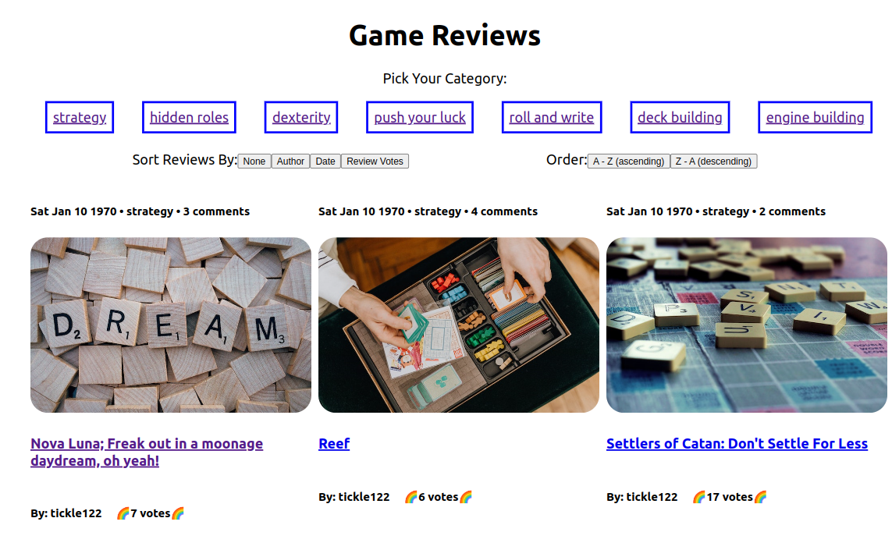

# Nico's NC Games Reviews - Front End

This project was bootstrapped with [Create React App](https://github.com/facebook/create-react-app).

## Background

Welcome to Nico's NC Games! This React app calls to the back-end NC Games API which can be found here: https://github.com/amnioc/nico_nc_games

Nico's NC Games can also be viewed on Netlify: https://nicos-nc-games.onrender.com/

This app provides an interactive user experience to engage with posts, add comments and upvote other content.

## Screenshot

## How To Clone and Run This Project Locally

You will have accessed this project via github.

From /amnioc/nico-nc-games, copy the HTTPS link to clone the repo locally.

From your terminal, identify an appropriate location and use the command:

git clone <insert_url_here>

To run this, you will need to install the dependencies as found in the package.json file. Please use the command:

npm i

The minimum requirements to run this project are:

Node.js: v19.8.1
Postgres: 14.7

### `npm start` to view locally

In your terminal use the command:

npm start

This will open the app in your browser.
